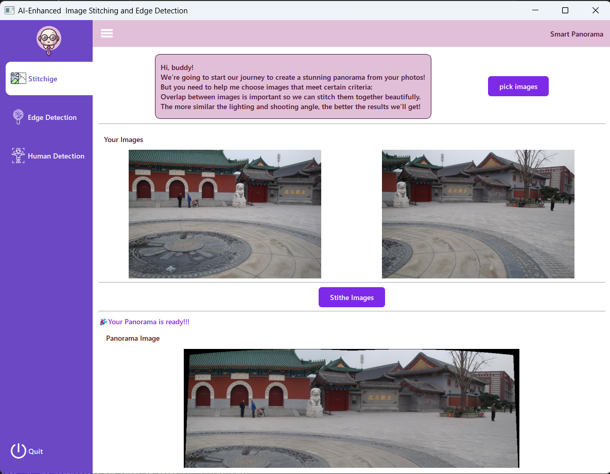
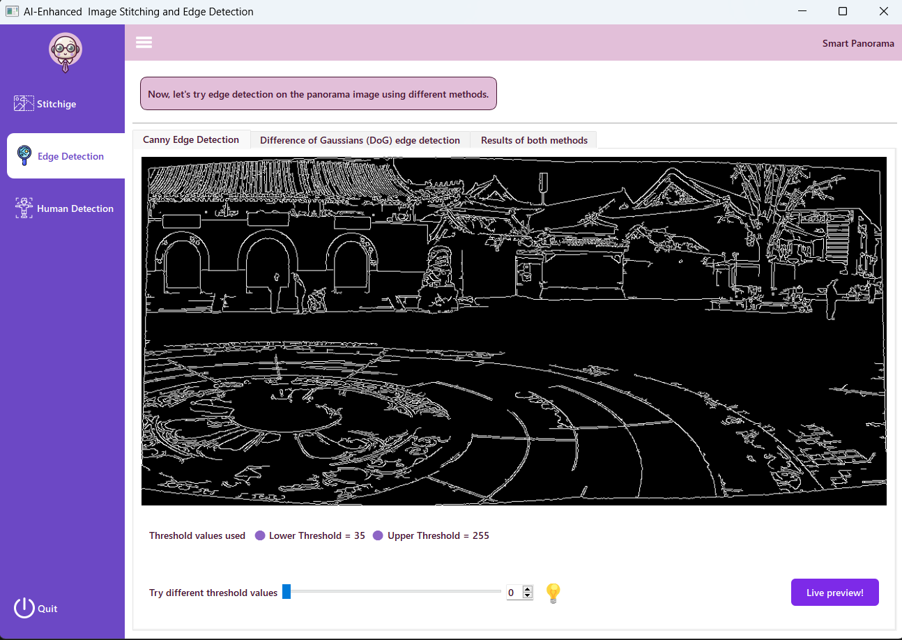
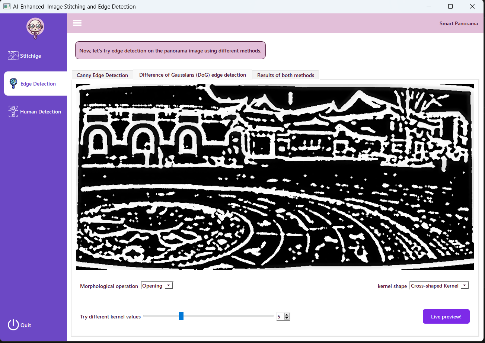
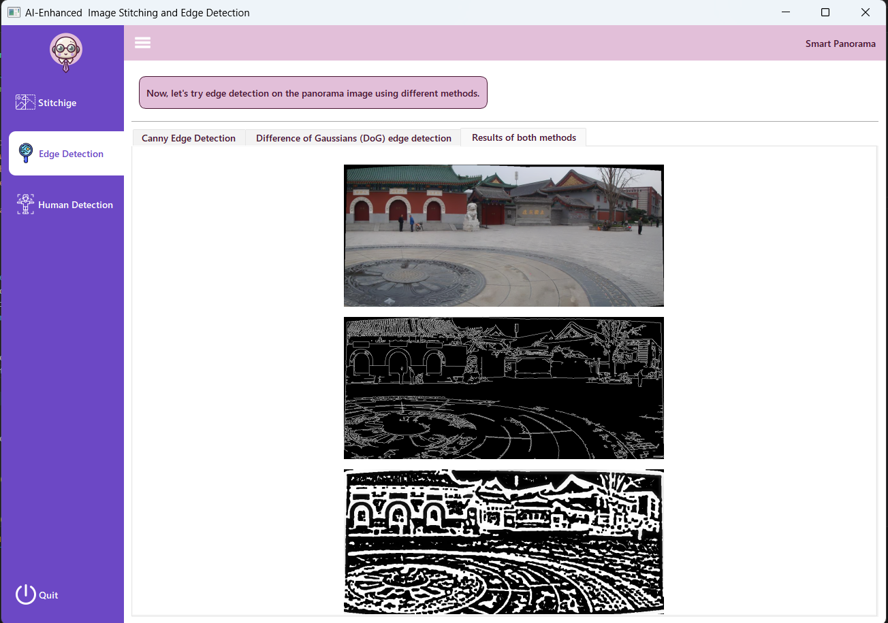
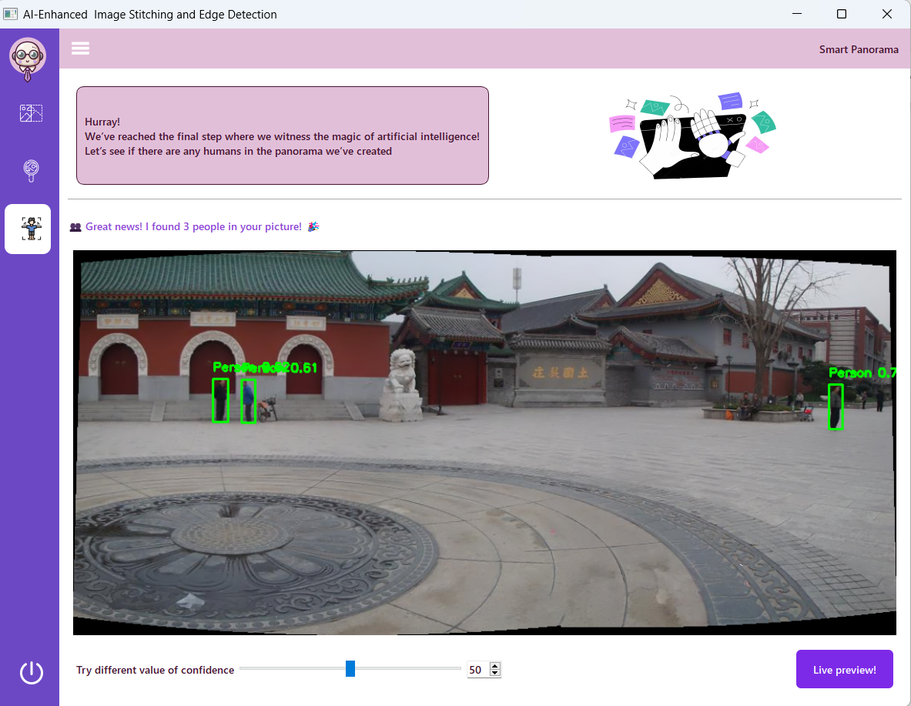

# PANORAMA LAB
## AI-Enhanced Image Stitching and Edge Detection

 
 

## 📝 Description

An advanced image processing application that combines panoramic image stitching with multiple edge detection techniques, including AI-powered human detection. The application provides an interactive interface for users to process multiple images and compare different edge detection results.

### ✨ Key Features

- **Image Stitching**: Combine multiple images into seamless panoramic views
- **Multiple Edge Detection Methods**:
  - Canny Edge Detection
  - Difference of Gaussians (DoG) with adjustable morphological operations
  - AI-based human edge detection (>50% confidence)
- **Interactive UI**: Built with Qt Designer for a user-friendly experience
- **Real-time Parameter Adjustment**: Dynamic control over edge detection parameters

## 📸 Screenshots 
| Page 1 | Page 2 Tab 1 |
|--------|---------------|
|  |  |

| Page 2 Tab 2 | Page 2 Tab 3 |
|---------------|---------------|
|  |  |

| Page 3 |
|--------|
|  |


## 🚀 Installation

### Prerequisites

```bash
- Python 3.8 or higher
- Qt Designer
- OpenCV
- NumPy
- PyQt5
```

### Setup (locally)

1. Clone the repository:
```bash
git clone https://github.com/AzzaEid/AI-Enhanced-Image-Processor-CVB.git
cd AI-Enhanced-Image-Processor-CVB
```

2. Create and activate a virtual environment:
```bash
python -m venv venv
source venv/bin/activate  # On Windows: venv\Scripts\activate
```

3. Install required packages:
```bash
pip install -r requirements.txt
```

## 🎮 Usage

1. Launch the application:
```bash
python main.py
```

2. Using the application:
   - **page 1**: Select and load your images for stitching
   - **page 2**: Adjust edge detection parameters
   - **page 3**: View AI-based human detection results
      **Use the side menu to navigate between pages.**


## 🏗️ Project Structure

```
AI-Enhanced-Image-Processor-CVB/
│
├── Models/
│   ├── __init__.py
│   ├── imageProcessor.py         # Processes panoramic images, returns responses
│   ├── commonFunctionality.py    # Shared functions like YOLO, DoG
│   ├── live_previews.py          # Connects to the user's camera
│   ├── imageType.py              # Enum for image types (e.g., panoramic, Canny)
│
├── Views/
│   ├── __init__.py
│   ├── MainWindow.py             # Main application interface
│   ├── resources_rc.py           # Binary data for assets used UI (e.g., Images)
│   ├── dialogs.py                # Dialog windows for tasks and interactions
│
├── Controller.py                 # Links UI events to image operations in models
├── main.py                       
├── requirements.txt
└── README.md
```

## 🛠️ Technical Details

### Technologies Used

- **UI Framework**: Qt Designer/PyQt5
- **Image Processing**: OpenCV
- **AI Detection**: YOLO11
- **Additional Libraries**: NumPy

### Features Implementation

1. **Image Stitching**
   - Uses OpenCV's stitching module
   - Supports multiple image formats
   - Automatic feature matching and blending

2. **Edge Detection**
   - Canny edge detection with adjustable thresholds
   - DoG implementation with customizable kernel sizes
   - Morphological operations for edge refinement

3. **AI-based Detection**
   - Pre-trained model for human detection (YOLO)
   - Confidence threshold filtering
   - Real-time processing capabilities


Currently in active development. Planned improvements:
- Support for additional edge detection algorithms
- Feature matching visualization for images before stitching
- Addressing UI Delays in PyQt with Background Processing 

---